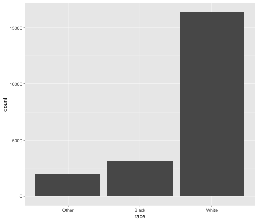
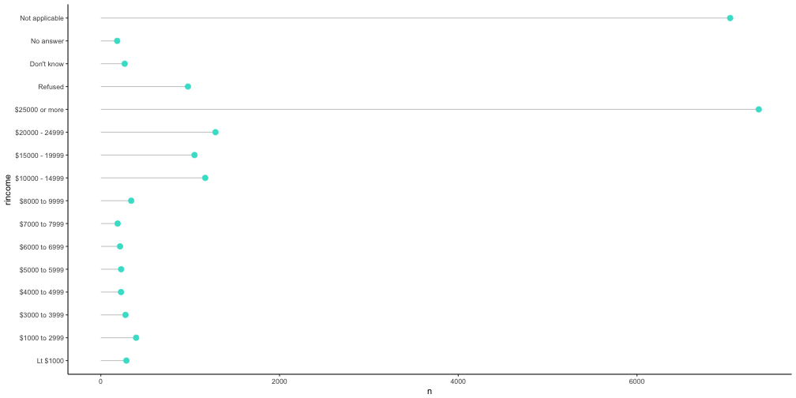
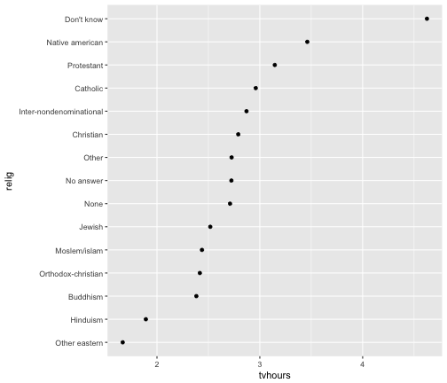

---
title       : Factors and Dates
author      : Daniel Anderson
framework   : io2012        # {io2012, html5slides, shower, dzslides, ...}
highlighter : highlight.js  # {highlight.js, prettify, highlight}
hitheme     : hemisu-light      # 
widgets     : []            # {mathjax, quiz, bootstrap}
mode        : selfcontained # {standalone, draft}
knit        : slidify::knit2slides
--- 
<style>
em {
  font-style: italic
}
</style>

<style>
strong {
  font-weight: bold;
}
</style>


## Agenda
* Basics of factors
	+ creating/modifying
	+ when you do/do not want factors
* Basics of Dates 
	+ Specifically, we'll focus date calculations

----
## Disclaimer
* We're obviously not going to cover all there is to know about factors and dates in one smashed-together two-hour lecture. 
* If we had more time, we'd spend a week on each. Instead you get one lecture.

---- 
# Factors

----
## Notice a difference?


```r
library(tidyverse)
tibble(lets = letters[1:3])
```

```
## # A tibble: 3 x 1
##    lets
##   <chr>
## 1     a
## 2     b
## 3     c
```

```r
data.frame(lets = letters[1:3])
```

```
##   lets
## 1    a
## 2    b
## 3    c
```

----
## What about now?


```r
str(tibble(lets = letters[1:3]))
```

```
## Classes 'tbl_df', 'tbl' and 'data.frame':	3 obs. of  1 variable:
##  $ lets: chr  "a" "b" "c"
```

```r
str(data.frame(lets = letters[1:3]))
```

```
## 'data.frame':	3 obs. of  1 variable:
##  $ lets: Factor w/ 3 levels "a","b","c": 1 2 3
```

----
## Why?
* Primarily historical reasons
	+ Factors used to be much easier to work with
	+ If you want to use the data for modeling, factors make more sense
		+ R is increasingly used for all sorts of things besides analysis, so it makes less sense for everything to be a factor

----
## What to do?
* Turn it off globally, but that's dangerous


```r
options(default.stringsAsFactors = FALSE)
```

* Turn it off in only the functions it affects, but you might forget


```r
str(data.frame(lets = letters[1:3], stringsAsFactors = FALSE))
```

```
## 'data.frame':	3 obs. of  1 variable:
##  $ lets: chr  "a" "b" "c"
```

* Use `rio::import` or *readr* (e.g., `readr::read_csv`), which will default
to reading strings in as strings

----
## Creating factors

* Imagine you have a vector of months


```r
months <- c("Dec", "Apr", "Jan", "Mar")
```

* We could store this as a string, but there are issues with this. 
	+ There are only 12 possible months 
		- factors will help us weed out values that don't conform to our predefined *levels*, which helps safeguard against typos, etc.
	+ You can't sort this vector in a meaningful way (it defaults to alphabetic)


```r
sort(months)
```

```
## [1] "Apr" "Dec" "Jan" "Mar"
```

----
## Define it as a factor


```r
month_levels <- c("Jan", "Feb", "Mar", "Apr", "May", "Jun", 
				  "Jul", "Aug", "Sep", "Oct", "Nov", "Dec")

months <- factor(months, levels = month_levels)
months
```

```
## [1] Dec Apr Jan Mar
## Levels: Jan Feb Mar Apr May Jun Jul Aug Sep Oct Nov Dec
```

* Now, we can sort	


```r
sort(months)
```

```
## [1] Jan Mar Apr Dec
## Levels: Jan Feb Mar Apr May Jun Jul Aug Sep Oct Nov Dec
```

----
## Also provides a safety net of sorts


```r
months[5] <- "Jam"
```

```
## Warning in `[<-.factor`(`*tmp*`, 5, value = "Jam"): invalid factor level,
## NA generated
```

```r
months
```

```
## [1] Dec  Apr  Jan  Mar  <NA>
## Levels: Jan Feb Mar Apr May Jun Jul Aug Sep Oct Nov Dec
```

----
## What if we don't specify the levels?

* If you define a factor without specifying the levels, it will assign them alphabetically


```r
mnths <- c("Dec", "Apr", "Jan", "Mar")
factor(mnths)
```

```
## [1] Dec Apr Jan Mar
## Levels: Apr Dec Jan Mar
```

* If you instead want them in the order they appeared in the data, use `unique` when specifying the levels (Why is `unique()` necessary? What's it doing?)


```r
factor(mnths, levels = unique(mnths))
```

```
## [1] Dec Apr Jan Mar
## Levels: Dec Apr Jan Mar
```


----
## Accessing and modifying levels
# Use the `levels` function
* To view the levels


```r
levels(months)
```

```
##  [1] "Jan" "Feb" "Mar" "Apr" "May" "Jun" "Jul" "Aug" "Sep" "Oct" "Nov"
## [12] "Dec"
```

* To modify the levels


```r
levels(months) <- 1:12
months
```

```
## [1] 12   4    1    3    <NA>
## Levels: 1 2 3 4 5 6 7 8 9 10 11 12
```

----
## If you need to, be specific


```r
months <- factor(months, levels = 1:12, labels = month_levels)
months
```

```
## [1] Dec  Apr  Jan  Mar  <NA>
## Levels: Jan Feb Mar Apr May Jun Jul Aug Sep Oct Nov Dec
```

----
## New package
* When working with factors, we can use the *forcats* package
	+ *for* **cat** egorical variables *s*
	+ anagram for factors
* Part of the tidyverse
	+ Should be installed for you already, but won't load with `library(tidyverse)`

<div align = "right">

</div>

----
## Changes factors back to the order they appeared


```r
c("Dec", "Apr", "Jan", "Mar") %>% 
	factor()
```

```
## [1] Dec Apr Jan Mar
## Levels: Apr Dec Jan Mar
```

```r
c("Dec", "Apr", "Jan", "Mar") %>% 
	factor(levels = c("Jan", "Mar", "Apr", "Dec"))
```

```
## [1] Dec Apr Jan Mar
## Levels: Jan Mar Apr Dec
```
... see next slide

----


```r
library(forcats)
c("Dec", "Apr", "Jan", "Mar") %>% 
	factor(levels = c("Jan", "Mar", "Apr", "Dec")) %>%  
	fct_inorder()
```

```
## [1] Dec Apr Jan Mar
## Levels: Dec Apr Jan Mar
```

----
## Or order by frequency


```r
c("b", "b", "c", "a", "a", "a") %>% 
	fct_infreq()
```

```
## [1] b b c a a a
## Levels: a b c
```

* This can be particularly useful for plotting

----
## words example


```r
data(sentences, package = "stringr")
sentences <- tibble(sent_num = seq_along(sentences), sentence = sentences)
library(tidytext)
words_freq <- sentences %>% 
	unnest_tokens(word, sentence) %>% 
	count(word) %>% 
	filter(n > 30)
words_freq
```

```
## # A tibble: 13 x 2
##     word     n
##    <chr> <int>
##  1     a   202
##  2   and   118
##  3   for    35
##  4    he    34
##  5    in    87
##  6    is    81
##  7    it    36
##  8    of   132
##  9    on    60
## 10   the   751
## 11    to   123
## 12   was    66
## 13  with    51
```

----
## Try to plot frequencies


```r
ggplot(words_freq, aes(word, n)) + 
	geom_col()
```


----
## Reorder according to frequency


```r
words_freq2 <- sentences %>% 
	unnest_tokens(word, sentence) %>% 
	mutate(word = fct_infreq(word)) %>% 
	count(word) %>% 
	filter(n > 30)
words_freq2
```

```
## # A tibble: 13 x 2
##      word     n
##    <fctr> <int>
##  1    the   751
##  2      a   202
##  3     of   132
##  4     to   123
##  5    and   118
##  6     in    87
##  7     is    81
##  8    was    66
##  9     on    60
## 10   with    51
## 11     it    36
## 12    for    35
## 13     he    34
```

----
## Reproduce plot


```r
ggplot(words_freq2, aes(word, n)) + 
	geom_col()
```


----
## Looking at the levels


```r
levels(factor(words_freq$word))
```

```
##  [1] "a"    "and"  "for"  "he"   "in"   "is"   "it"   "of"   "on"   "the" 
## [11] "to"   "was"  "with"
```

```r
levels(words_freq2$word)
```

```
##    [1] "the"        "a"          "of"         "to"         "and"       
##    [6] "in"         "is"         "was"        "on"         "with"      
##   [11] "it"         "for"        "he"         "are"        "from"      
##   [16] "will"       "his"        "we"         "at"         "but"       
##   [21] "were"       "into"       "they"       "you"        "your"      
##   [26] "that"       "when"       "this"       "by"         "be"        
##   [31] "old"        "than"       "as"         "high"       "out"       
##   [36] "red"        "there"      "these"      "down"       "fine"      
##   [41] "green"      "hot"        "new"        "she"        "small"     
##   [46] "strong"     "up"         "used"       "wall"       "before"    
##   [51] "good"       "hard"       "her"        "makes"      "round"     
##   [56] "thin"       "two"        "water"      "way"        "young"     
##   [61] "best"       "blue"       "both"       "bright"     "dull"      
##   [66] "each"       "gold"       "him"        "kept"       "last"      
##   [71] "most"       "no"         "or"         "sharp"      "take"      
##   [76] "all"        "box"        "brass"      "brown"      "clear"     
##   [81] "grass"      "its"        "left"       "made"       "man"       
##   [86] "men"        "more"       "night"      "now"        "over"      
##   [91] "paper"      "road"       "side"       "tea"        "top"       
##   [96] "us"         "wide"       "write"      "air"        "along"     
##  [101] "back"       "boy"        "cut"        "early"      "fence"     
##  [106] "fire"       "floor"      "get"        "girl"       "had"       
##  [111] "have"       "horse"      "hung"       "large"      "leaves"    
##  [116] "light"      "like"       "make"       "many"       "mark"      
##  [121] "much"       "off"        "once"       "our"        "see"       
##  [126] "set"        "ship"       "store"      "sun"        "takes"     
##  [131] "tall"       "their"      "third"      "three"      "took"      
##  [136] "white"      "wind"       "work"       "add"        "around"    
##  [141] "big"        "black"      "book"       "broke"      "came"      
##  [146] "can"        "case"       "cat"        "child"      "coat"      
##  [151] "cold"       "day"        "days"       "deep"       "desk"      
##  [156] "do"         "dog"        "door"       "dry"        "fell"      
##  [161] "first"      "hole"       "house"      "just"       "lack"      
##  [166] "less"       "lost"       "needs"      "next"       "not"       
##  [171] "pack"       "part"       "pot"        "ran"        "rare"      
##  [176] "right"      "rose"       "show"       "smell"      "straight"  
##  [181] "ten"        "through"    "tight"      "time"       "well"      
##  [186] "what"       "words"      "worn"       "act"        "bad"       
##  [191] "bank"       "beat"       "better"     "between"    "bring"     
##  [196] "chair"      "clean"      "cloth"      "clothes"    "come"      
##  [201] "corn"       "corner"     "could"      "dark"       "dust"      
##  [206] "edge"       "end"        "every"      "fast"       "fish"      
##  [211] "fly"        "friends"    "full"       "fun"        "great"     
##  [216] "help"       "here"       "hold"       "home"       "ice"       
##  [221] "ink"        "keep"       "lay"        "little"     "low"       
##  [226] "moved"      "needed"     "paint"      "read"       "ring"      
##  [231] "ripe"       "salt"       "same"       "saw"        "serve"     
##  [236] "sheet"      "should"     "slide"      "soft"       "some"      
##  [241] "sound"      "spring"     "start"      "stone"      "stood"     
##  [246] "street"     "struck"     "sweet"      "taste"      "tell"      
##  [251] "thick"      "those"      "town"       "under"      "while"     
##  [256] "wood"       "across"     "almost"     "always"     "an"        
##  [261] "any"        "barn"       "base"       "beach"      "beef"      
##  [266] "bell"       "beside"     "blow"       "boat"       "bowl"      
##  [271] "breeze"     "brought"    "built"      "burn"       "burned"    
##  [276] "carpet"     "carved"     "catch"      "cause"      "chart"     
##  [281] "children"   "china"      "clock"      "cloud"      "comes"     
##  [286] "contents"   "cord"       "cover"      "covered"    "crack"     
##  [291] "crawled"    "cup"        "dirt"       "don"        "don't"     
##  [296] "done"       "dried"      "drifts"     "drink"      "drive"     
##  [301] "drop"       "empty"      "failed"     "fall"       "far"       
##  [306] "feet"       "few"        "find"       "finish"     "fit"       
##  [311] "five"       "flame"      "flood"      "food"       "form"      
##  [316] "found"      "free"       "front"      "fruit"      "gave"      
##  [321] "gives"      "glass"      "hands"      "has"        "hat"       
##  [326] "head"       "heat"       "heavy"      "if"         "jerk"      
##  [331] "joy"        "jump"       "knife"      "lamp"       "laugh"     
##  [336] "lawn"       "lead"       "leave"      "line"       "lines"     
##  [341] "long"       "loud"       "march"      "may"        "morning"   
##  [346] "mouse"      "move"       "near"       "neat"       "need"      
##  [351] "north"      "note"       "odor"       "office"     "often"     
##  [356] "one"        "open"       "pail"       "pearl"      "pencil"    
##  [361] "pie"        "pink"       "pipe"       "plans"      "poor"      
##  [366] "port"       "pure"       "put"        "quick"      "quite"     
##  [371] "rings"      "room"       "sad"        "sand"       "sat"       
##  [376] "say"        "screen"     "seen"       "sent"       "served"    
##  [381] "seven"      "shirt"      "shoe"       "shone"      "shore"     
##  [386] "short"      "size"       "sky"        "soap"       "space"     
##  [391] "spot"       "square"     "stain"      "steady"     "stew"      
##  [396] "stop"       "straw"      "swan"       "t"          "tales"     
##  [401] "tan"        "tender"     "then"       "times"      "tin"       
##  [406] "tired"      "too"        "torn"       "tree"       "tried"     
##  [411] "turn"       "waste"      "watch"      "week"       "went"      
##  [416] "wet"        "where"      "who"        "win"        "without"   
##  [421] "wooden"     "wrote"      "after"      "again"      "against"   
##  [426] "age"        "apart"      "apple"      "away"       "bag"       
##  [431] "bare"       "beauty"     "beer"       "began"      "bent"      
##  [436] "bill"       "bills"      "birch"      "birth"      "block"     
##  [441] "blocks"     "blows"      "board"      "boards"     "books"     
##  [446] "bound"      "brand"      "break"      "brew"       "button"    
##  [451] "cannot"     "cap"        "care"       "cart"       "cats"      
##  [456] "caught"     "cement"     "cents"      "chance"     "chicken"   
##  [461] "chopped"    "clay"       "coin"       "coins"      "colt"      
##  [466] "compass"    "cool"       "costly"     "costs"      "couch"     
##  [471] "cracked"    "crackers"   "crash"      "crate"      "crooked"   
##  [476] "crowd"      "curls"      "curtain"    "cushion"    "cuts"      
##  [481] "debt"       "dense"      "dig"        "dip"        "dirty"     
##  [486] "dish"       "distance"   "doubt"      "draft"      "dress"     
##  [491] "drip"       "earth"      "easy"       "edges"      "eggs"      
##  [496] "enough"     "even"       "eyes"       "fail"       "fair"      
##  [501] "fans"       "farmer"     "fasten"     "felt"       "field"     
##  [506] "fight"      "fill"       "fired"      "firm"       "fits"      
##  [511] "flat"       "float"      "floated"    "foot"       "force"     
##  [516] "forget"     "four"       "freeze"     "fresh"      "friend"    
##  [521] "friendly"   "fudge"      "fund"       "funds"      "fur"       
##  [526] "gate"       "gay"        "gently"     "gets"       "glasses"   
##  [531] "glue"       "go"         "goes"       "gone"       "got"       
##  [536] "grace"      "graceful"   "grain"      "gray"       "grew"      
##  [541] "ground"     "grow"       "half"       "hatch"      "health"    
##  [546] "hear"       "held"       "hoist"      "horn"       "hours"     
##  [551] "inches"     "inside"     "it's"       "jacket"     "jar"       
##  [556] "join"       "juice"      "jumped"     "june"       "kite"      
##  [561] "lake"       "late"       "lathe"      "lawyer"     "led"       
##  [566] "let"        "life"       "limp"       "list"       "log"       
##  [571] "logs"       "looked"     "lose"       "loss"       "lot"       
##  [576] "luck"       "main"       "making"     "mat"        "means"     
##  [581] "met"        "middle"     "miles"      "money"      "month"     
##  [586] "mud"        "mule"       "music"      "must"       "my"        
##  [591] "nail"       "name"       "names"      "nine"       "nose"      
##  [596] "nothing"    "only"       "ordered"    "orders"     "other"     
##  [601] "others"     "page"       "painted"    "pants"      "parts"     
##  [606] "past"       "path"       "pay"        "pears"      "peas"      
##  [611] "person"     "phone"      "phrase"     "pierced"    "pile"      
##  [616] "pills"      "pine"       "pins"       "place"      "plan"      
##  [621] "plant"      "plate"      "play"       "player"     "plead"     
##  [626] "pleasant"   "please"     "point"      "pole"       "porch"     
##  [631] "post"       "press"      "pressed"    "prince"     "punch"     
##  [636] "pup"        "quickly"    "rain"       "raise"      "rang"      
##  [641] "reach"      "rice"       "rich"       "rider"      "rise"      
##  [646] "river"      "rope"       "rug"        "ruins"      "rum"       
##  [651] "rusty"      "sandy"      "scared"     "school"     "score"     
##  [656] "screw"      "sea"        "second"     "seems"      "seized"    
##  [661] "sell"       "send"       "sense"      "settle"     "sew"       
##  [666] "shake"      "shaky"      "shape"      "sheep"      "shelves"   
##  [671] "shoes"      "silk"       "silver"     "six"        "skill"     
##  [676] "sleep"      "sleeping"   "slid"       "slipped"    "slow"      
##  [681] "smile"      "smoke"      "smoky"      "smooth"     "snow"      
##  [686] "soak"       "sold"       "soldiers"   "soon"       "source"    
##  [691] "spilled"    "stale"      "steam"      "steel"      "step"      
##  [696] "stick"      "sticky"     "stiff"      "stories"    "storm"     
##  [701] "story"      "stranger"   "stream"     "stretched"  "strike"    
##  [706] "such"       "sugar"      "sum"        "sunday"     "sure"      
##  [711] "swim"       "tack"       "talked"     "tank"       "tasty"     
##  [716] "tent"       "thing"      "things"     "thirty"     "threw"     
##  [721] "trap"       "tray"       "try"        "tube"       "tuesday"   
##  [726] "turned"     "twisted"    "useless"    "valve"      "vest"      
##  [731] "wake"       "want"       "waved"      "ways"       "weak"      
##  [736] "weather"    "weight"     "which"      "wild"       "winding"   
##  [741] "wine"       "wise"       "word"       "worse"      "yacht"     
##  [746] "year"       "years"      "yellow"     "zest"       "about"     
##  [751] "abrupt"     "absent"     "account"    "acid"       "actor"     
##  [756] "actress"    "adding"     "admire"     "admit"      "ads"       
##  [761] "aid"        "aim"        "alarm"      "allowed"    "aloft"     
##  [766] "also"       "although"   "amounts"    "ancient"    "answer"    
##  [771] "antique"    "apples"     "arm"        "arrive"     "arrived"   
##  [776] "ashes"      "asks"       "attack"     "attacked"   "attic"     
##  [781] "axe"        "baby"       "background" "backs"      "badly"     
##  [786] "bail"       "balance"    "balked"     "ball"       "band"      
##  [791] "banned"     "bark"       "barred"     "barrel"     "batches"   
##  [796] "bath"       "bathe"      "bay"        "beam"       "bear"      
##  [801] "became"     "beck"       "been"       "beetle"     "bench"     
##  [806] "bend"       "betrayed"   "bid"        "bike"       "bind"      
##  [811] "binds"      "bird"       "biscuits"   "blades"     "blew"      
##  [816] "blind"      "bloom"      "blotter"    "blown"      "blushed"   
##  [821] "boiled"     "boldly"     "bolted"     "bombs"      "bond"      
##  [826] "bonds"      "booth"      "booze"      "boss"       "bottles"   
##  [831] "bottom"     "bowls"      "boys"       "braid"      "branches"  
##  [836] "breakfast"  "breathe"    "bred"       "bribes"     "bricks"    
##  [841] "brightened" "brim"       "brings"     "brisk"      "broken"    
##  [846] "brothers"   "bucket"     "buckle"     "bump"       "bun"       
##  [851] "bunch"      "buns"       "burns"      "burnt"      "bushes"    
##  [856] "business"   "busses"     "buy"        "buyer"      "buyers"    
##  [861] "calf"       "called"     "calves"     "canned"     "canoe"     
##  [866] "cans"       "cape"       "capture"    "car"        "card"      
##  [871] "carry"      "cars"       "cartridge"  "castle"     "caused"    
##  [876] "cent"       "central"    "chairs"     "changes"    "changing"  
##  [881] "chap"       "charm"      "chased"     "cheap"      "cheat"     
##  [886] "cheese"     "cherish"    "cherries"   "chicks"     "chief"     
##  [891] "child's"    "chink"      "choose"     "chorus"     "cigar"     
##  [896] "circled"    "circus"     "claim"      "clams"      "clan"      
##  [901] "clap"       "class"      "cleanse"    "cleat"      "clink"     
##  [906] "clips"      "close"      "closely"    "closet"     "clouds"    
##  [911] "clowns"     "club"       "coach"      "coal"       "coax"      
##  [916] "cobs"       "cod"        "code"       "coffee"     "colds"     
##  [921] "collapse"   "collar"     "color"      "colored"    "column"    
##  [926] "comfort"    "cone"       "constant"   "contest"    "cook"      
##  [931] "cooked"     "cop"        "copper"     "cork"       "cost"      
##  [936] "council"    "counted"    "courage"    "court"      "cow"       
##  [941] "cramp"      "crane"      "creaked"    "cream"      "creek"     
##  [946] "crew"       "cried"      "crop"       "cross"      "crouch"    
##  [951] "crowded"    "cruise"     "cruiser"    "crunch"     "cue"       
##  [956] "cuffs"      "cure"       "cured"      "curled"     "daily"     
##  [961] "dam"        "dance"      "danced"     "danger"     "dart"      
##  [966] "dash"       "death"      "decide"     "deepened"   "deeply"    
##  [971] "defense"    "depth"      "deserve"    "designed"   "designs"   
##  [976] "despair"    "dew"        "dice"       "different"  "dill"      
##  [981] "dim"        "dime"       "dimes"      "dinner"     "dipped"    
##  [986] "discuss"    "dishes"     "dispense"   "distinct"   "ditch"     
##  [991] "dive"       "doctor"     "does"       "dogs"       "doll"      
##  [996] "doorknob"   "dots"       "drapes"     "draw"       "drenching" 
## [1001] "drilled"    "drinks"     "drizzle"    "droned"     "droop"     
## [1006] "droopy"     "dropped"    "drove"      "drown"      "drug"      
## [1011] "ducks"      "duke"       "dune"       "dunk"       "dusty"     
## [1016] "dying"      "e"          "ear"        "earned"     "ears"      
## [1021] "east"       "eastern"    "eat"        "eaten"      "egg"       
## [1026] "eight"      "either"     "else"       "ended"      "ends"      
## [1031] "endure"     "equal"      "erase"      "errand"     "error"     
## [1036] "evade"      "evening"    "events"     "extra"      "eye"       
## [1041] "eyelids"    "face"       "faced"      "factors"    "facts"     
## [1046] "fails"      "fairy"      "fake"       "fallen"     "false"     
## [1051] "fame"       "fan"        "farm"       "farmers"    "farther"   
## [1056] "faults"     "feather"    "fed"        "feed"       "feel"      
## [1061] "feline"     "ferment"    "fern"       "fevers"     "fields"    
## [1066] "fierce"     "fifth"      "fifty"      "fig"        "figs"      
## [1071] "figures"    "filing"     "filled"     "fin"        "finished"  
## [1076] "fires"      "firmly"     "fix"        "fizz"       "flames"    
## [1081] "flaps"      "flashy"     "flask"      "flavor"     "flavors"   
## [1086] "flaw"       "flax"       "fleet"      "flew"       "flickered" 
## [1091] "flint"      "flop"       "flounder"   "flower"     "follow"    
## [1096] "fond"       "fool"       "football"   "footprints" "forest"    
## [1101] "forin"      "former"     "fox"        "frail"      "freed"     
## [1106] "french"     "fright"     "frighten"   "frocks"     "frog"      
## [1111] "frost"      "frosted"    "frosty"     "frown"      "frozen"    
## [1116] "fry"        "fury"       "gain"       "game"       "gang"      
## [1121] "garbage"    "gas"        "gather"     "gathered"   "gaunt"     
## [1126] "gem"        "gift"       "gifts"      "give"       "glaring"   
## [1131] "gloss"      "glow"       "gnawed"     "goose"      "grand"     
## [1136] "grape"      "grapes"     "grease"     "greet"      "grin"      
## [1141] "group"      "groups"     "grows"      "guess"      "guests"    
## [1146] "gun"        "guy"        "hail"       "hailed"     "hall"      
## [1151] "halt"       "ham"        "hammer"     "hand"       "hang"      
## [1156] "happen"     "harder"     "hardly"     "hardship"   "hardware"  
## [1161] "hash"       "hate"       "hats"       "hazy"       "healthy"   
## [1166] "heap"       "heart"      "hearts"     "heave"      "hedge"     
## [1171] "heir"       "helped"     "helps"      "hemp"       "hero"      
## [1176] "heroes"     "hewn"       "hidden"     "highway"    "hikes"     
## [1181] "hill"       "hilt"       "hind"       "hinge"      "hip"       
## [1186] "hired"      "hissed"     "hit"        "hitch"      "hog"       
## [1191] "hogs"       "holes"      "honest"     "honor"      "hook"      
## [1196] "hop"        "hope"       "hops"       "hose"       "hostess"   
## [1201] "housed"     "houses"     "huge"       "hurdle"     "hurry"     
## [1206] "hurt"       "idea"       "ii"         "improves"   "informs"   
## [1211] "inn"        "islands"    "itches"     "items"      "jail"      
## [1216] "jam"        "jammed"     "jangled"    "jazz"       "jell"      
## [1221] "jerked"     "job"        "journey"    "jtith"      "judge"     
## [1226] "jug"        "junk"       "keeps"      "key"        "kick"      
## [1231] "kid"        "kids"       "kind"       "kindle"     "kinds"     
## [1236] "king"       "king's"     "kits"       "kitten"     "kittens"   
## [1241] "knee"       "knew"       "know"       "ladies"     "lag"       
## [1246] "lamb"       "lame"       "landing"    "lantern"    "lanterns"  
## [1251] "lasts"      "latch"      "later"      "lazy"       "leads"     
## [1256] "leaf"       "league"     "leaned"     "lease"      "leash"     
## [1261] "leather"    "ledge"      "leg"        "lemons"     "length"    
## [1266] "lent"       "let's"      "level"      "lift"       "limb"      
## [1271] "limits"     "lined"      "lingers"    "lire"       "lists"     
## [1276] "lit"        "littered"   "lived"      "lives"      "living"    
## [1281] "load"       "lobes"      "lock"       "locked"     "lodging"   
## [1286] "lofty"      "lonesome"   "look"       "looks"      "loop"      
## [1291] "love"       "lsrge"      "luggage"    "lure"       "lush"      
## [1296] "madam"      "maid"       "mail"       "mailed"     "mails"     
## [1301] "malt"       "man's"      "mantel"     "map"        "maple"     
## [1306] "maps"       "marble"     "mare"       "market"     "marsh"     
## [1311] "mass"       "match"      "mats"       "matter"     "matters"   
## [1316] "maze"       "meal"       "meant"      "mend"       "merge"     
## [1321] "mesh"       "metal"      "meter"      "method"     "mild"      
## [1326] "milk"       "mince"      "minds"      "minutes"    "mire"      
## [1331] "miss"       "missed"     "mix"        "mob"        "mondays"   
## [1336] "moss"       "mouldy"     "mouth"      "moves"      "moving"    
## [1341] "muff"       "muffled"    "mules"      "mumble"     "mute"      
## [1346] "nag"        "narrow"     "nasty"      "natives"    "navy"      
## [1351] "neatly"     "neck"       "necklace"   "neighbor's" "neon"      
## [1356] "nerves"     "nest"       "net"        "nets"       "news"      
## [1361] "nho"        "nice"       "node"       "noise"      "none"      
## [1366] "noon"       "northern"   "northward"  "novel"      "nozzle"    
## [1371] "nudge"      "oak"        "oat"        "oath"       "oats"      
## [1376] "objects"    "occurred"   "offered"    "oiled"      "ones"      
## [1381] "onto"       "orange"     "orchid"     "order"      "ought"     
## [1386] "outdoors"   "outside"    "owed"       "ox"         "pace"      
## [1391] "package"    "packed"     "pad"        "pages"      "paid"      
## [1396] "painful"    "painting"   "pal"        "palate"     "pan"       
## [1401] "parades"    "park"       "parked"     "partner"    "party"     
## [1406] "pass"       "passage"    "passed"     "paste"      "pattered"  
## [1411] "paved"      "paw"        "payment"    "peace"      "peach"     
## [1416] "peak"       "peat"       "pedal"      "peddler"    "peel"      
## [1421] "peep"       "peg"        "pen"        "pencils"    "pennant"   
## [1426] "penny"      "people"     "pepper"     "per"        "perch"     
## [1431] "perfect"    "period"     "pet"        "petals"     "phase"     
## [1436] "pick"       "picked"     "pickle"     "pickles"    "piece"     
## [1441] "piles"      "pin"        "piny"       "pipes"      "pirate's"  
## [1446] "pirates"    "pit"        "pitch"      "planes"     "plank"     
## [1451] "planks"     "played"     "players"    "playing"    "plea"      
## [1456] "pleasure"   "pluck"      "plum"       "plunge"     "plus"      
## [1461] "plush"      "poached"    "pocket"     "pockets"    "pod"       
## [1466] "pods"       "polish"     "poodles"    "pound"      "pour"      
## [1471] "poured"     "power"      "preserve"   "price"      "priceless" 
## [1476] "print"      "prize"      "problems"   "prod"       "product"   
## [1481] "profit"     "promptly"   "prone"      "proof"      "protects"  
## [1486] "public"     "puff"       "pulled"     "purple"     "purse"     
## [1491] "push"       "pushed"     "puts"       "puzzling"   "quart"     
## [1496] "queen's"    "quench"     "rack"       "raft"       "rag"       
## [1501] "raging"     "rags"       "rained"     "rainy"      "rake"      
## [1506] "ram"        "ramp"       "rarest"     "rate"       "raw"       
## [1511] "rays"       "reached"    "reads"      "rear"       "reared"    
## [1516] "records"    "reef"       "relax"      "release"    "rented"    
## [1521] "replace"    "requests"   "response"   "restless"   "restores"  
## [1526] "results"    "revives"    "revolved"   "ribbons"    "ridge"     
## [1531] "rink"       "roads"      "rob"        "robbed"     "robins"    
## [1536] "rocks"      "rod"        "roll"       "roof"       "rosebush"  
## [1541] "rough"      "roused"     "rows"       "rubbish"    "rude"      
## [1546] "ruled"      "runs"       "rush"       "rust"       "s"         
## [1551] "said"       "sail"       "sale"       "salmon"     "salty"     
## [1556] "sang"       "sank"       "sash"       "sausage"    "save"      
## [1561] "saved"      "saves"      "says"       "scale"      "scarce"    
## [1566] "scarcer"    "scare"      "schools"    "scoot"      "scores"    
## [1571] "scraps"     "scratch"    "seals"      "season"     "seats"     
## [1576] "secret"     "secrets"    "seed"       "seeds"      "seemed"    
## [1581] "seldom"     "sever"      "severe"     "sewed"      "shade"     
## [1586] "shaggy"     "shall"      "shallow"    "shaped"     "shares"    
## [1591] "sheath"     "shed"       "sheets"     "shell"      "shelter"   
## [1596] "shield"     "shift"      "shimmered"  "shine"      "shiny"     
## [1601] "shipped"    "shipping"   "shoelace"   "shortened"  "shoulder"  
## [1606] "showed"     "shower"     "showered"   "shrubs"     "shut"      
## [1611] "sick"       "sickness"   "sides"      "siege"      "sight"     
## [1616] "sign"       "sill"       "simplest"   "sing"       "sink"      
## [1621] "sinking"    "sip"        "sit"        "sixteen"    "skin"      
## [1626] "slab"       "slam"       "slang"      "slant"      "slash"     
## [1631] "slat"       "sleek"      "slice"      "slices"     "slidc"     
## [1636] "slides"     "slip"       "slush"      "smart"      "smatter"   
## [1641] "smuggled"   "snapped"    "snapper"    "snip"       "snowed"    
## [1646] "so"         "sock"       "sockets"    "sofa"       "softly"    
## [1651] "sometimes"  "sour"       "spark"      "sparkled"   "sparks"    
## [1656] "spattered"  "speaks"     "speech"     "speed"      "speedy"    
## [1661] "spend"      "spice"      "spill"      "spin"       "split"     
## [1666] "spoils"     "spread"     "sputtered"  "squirrel"   "st"        
## [1671] "stable"     "stage"      "stalk"      "stalled"    "stamped"   
## [1676] "stand"      "stare"      "stark"      "started"    "state"     
## [1681] "stately"    "statement"  "stayed"     "steep"      "steer"     
## [1686] "stems"      "steps"      "sticks"     "still"      "stitch"    
## [1691] "stockings"  "stole"      "stones"     "store's"    "strained"  
## [1696] "strap"      "stray"      "streak"     "streets"    "strength"  
## [1701] "strip"      "stripe"     "strive"     "strokes"    "strongly"  
## [1706] "stubborn"   "stuff"      "stuffed"    "stung"      "stunned"   
## [1711] "stupid"     "stylish"    "suffer"     "suffice"    "suit"      
## [1716] "sullen"     "sums"       "sun's"      "surface"    "swam"      
## [1721] "swapped"    "swayed"     "sweater"    "swell"      "swing"     
## [1726] "switch"     "sword"      "table"      "tacks"      "tailor"    
## [1731] "tame"       "tang"       "tape"       "taps"       "tar"       
## [1736] "target"     "task"       "tastes"     "taught"     "teach"     
## [1741] "team"       "tear"       "teeth"      "tend"       "tenth"     
## [1746] "term"       "thaw"       "theft"      "thief"      "thieves"   
## [1751] "think"      "thirst"     "thistles"   "thought"    "thresh"    
## [1756] "thrive"     "throne"     "throw"      "thrown"     "thumb"     
## [1761] "tide"       "tie"        "ties"       "tightly"    "tile"      
## [1766] "tilted"     "timing"     "tinged"     "tinsel"     "tiny"      
## [1771] "tire"       "toad"       "today"      "told"       "tones"     
## [1776] "tongs"      "tool"       "torch"      "tore"       "touch"     
## [1781] "toys"       "trace"      "track"      "trail"      "train"     
## [1786] "trample"    "trash"      "treadmill"  "trim"       "trims"     
## [1791] "trinkets"   "trod"       "troops"     "tropics"    "trotted"   
## [1796] "trout"      "truck"      "true"       "trunk"      "trust"     
## [1801] "tuck"       "tumbled"    "tumbles"    "tunes"      "turf"      
## [1806] "turkey"     "turns"      "tusk"       "twelfth"    "twin"      
## [1811] "twine"      "twist"      "type"       "unfit"      "unless"    
## [1816] "urge"       "use"        "vamp"       "van"        "vane"      
## [1821] "vase"       "vast"       "vat"        "vent"       "verdict"   
## [1826] "verse"      "very"       "view"       "vote"       "vouch"     
## [1831] "wading"     "wagon"      "wait"       "waiting"    "walk"      
## [1836] "walked"     "walking"    "walled"     "walls"      "walnut"    
## [1841] "wanders"    "war"        "warm"       "warmth"     "warp"      
## [1846] "wash"       "watched"    "watchful"   "waters"     "waves"     
## [1851] "wax"        "waxed"      "weakly"     "wear"       "wearing"   
## [1856] "weave"      "weed"       "weeks"      "west"       "wharf"     
## [1861] "wheat"      "wheeled"    "wheels"     "whiff"      "whirled"   
## [1866] "whiskey"    "whistling"  "whitings"   "whole"      "wildly"    
## [1871] "window"     "winds"      "wipe"       "wires"      "wisp"      
## [1876] "wit"        "woke"       "woman"      "women"      "wonders"   
## [1881] "woodland"   "woods"      "wool"       "wore"       "working"   
## [1886] "workmen's"  "world"      "worm"       "worst"      "would"     
## [1891] "woven"      "wreck"      "wrist"      "writer"     "writes"    
## [1896] "wrong"      "x"          "xew"        "y"          "yard"      
## [1901] "yell"       "youth"      "zestful"    "zones"
```

----
## When do we really want factors?
Generally two reasons to declare a factor
* Only finite number of categories
	+ Treatment/control
	+ Income categories
	+ Performance levels
	+ etc.
* Use in modeling

----
## GSS
General Social Survey
* We dealt with some of these data for a homework. 
* Unbeknownst to me, Hadley also included a sample in the *forcats* dataset


```r
gss_cat
```

```
## # A tibble: 21,483 x 9
##     year       marital   age   race        rincome            partyid
##    <int>        <fctr> <int> <fctr>         <fctr>             <fctr>
##  1  2000 Never married    26  White  $8000 to 9999       Ind,near rep
##  2  2000      Divorced    48  White  $8000 to 9999 Not str republican
##  3  2000       Widowed    67  White Not applicable        Independent
##  4  2000 Never married    39  White Not applicable       Ind,near rep
##  5  2000      Divorced    25  White Not applicable   Not str democrat
##  6  2000       Married    25  White $20000 - 24999    Strong democrat
##  7  2000 Never married    36  White $25000 or more Not str republican
##  8  2000      Divorced    44  White  $7000 to 7999       Ind,near dem
##  9  2000       Married    44  White $25000 or more   Not str democrat
## 10  2000       Married    47  White $25000 or more  Strong republican
## # ... with 21,473 more rows, and 3 more variables: relig <fctr>,
## #   denom <fctr>, tvhours <int>
```

----
## Investigate factors
Tidyverse gives you convenient  ways to evaluate factors
* Use `count` - no need to use `group_by`
* Use `geom_bar` or `geom_col` with *ggplot*

---- 


```r
gss_cat %>% 
	count(partyid)
```

```
## # A tibble: 10 x 2
##               partyid     n
##                <fctr> <int>
##  1          No answer   154
##  2         Don't know     1
##  3        Other party   393
##  4  Strong republican  2314
##  5 Not str republican  3032
##  6       Ind,near rep  1791
##  7        Independent  4119
##  8       Ind,near dem  2499
##  9   Not str democrat  3690
## 10    Strong democrat  3490
```


```r
gss_cat %>% 
	count(relig)
```

```
## # A tibble: 15 x 2
##                      relig     n
##                     <fctr> <int>
##  1               No answer    93
##  2              Don't know    15
##  3 Inter-nondenominational   109
##  4         Native american    23
##  5               Christian   689
##  6      Orthodox-christian    95
##  7            Moslem/islam   104
##  8           Other eastern    32
##  9                Hinduism    71
## 10                Buddhism   147
## 11                   Other   224
## 12                    None  3523
## 13                  Jewish   388
## 14                Catholic  5124
## 15              Protestant 10846
```

----

```r
ggplot(gss_cat, aes(partyid)) +
	geom_bar()
```


----

```r
ggplot(gss_cat, aes(relig)) +
	geom_bar()
```


---- 
## Include missing categories


```r
ggplot(gss_cat, aes(race)) +
	geom_bar() 
```




```r
ggplot(gss_cat, aes(race)) +
	geom_bar() +
	scale_x_discrete(drop = FALSE)
```


----
## What about this?


```r
ggplot(gss_cat, aes(rincome)) +
	geom_bar()
```


----

```r
levels(gss_cat$rincome)
```

```
##  [1] "No answer"      "Don't know"     "Refused"        "$25000 or more"
##  [5] "$20000 - 24999" "$15000 - 19999" "$10000 - 14999" "$8000 to 9999" 
##  [9] "$7000 to 7999"  "$6000 to 6999"  "$5000 to 5999"  "$4000 to 4999" 
## [13] "$3000 to 3999"  "$1000 to 2999"  "Lt $1000"       "Not applicable"
```

```r
gss <- gss_cat %>% 
	mutate(rincome = factor(rincome, levels = levels(rincome)[c(15:1, 16)]))
levels(gss$rincome)
```

```
##  [1] "Lt $1000"       "$1000 to 2999"  "$3000 to 3999"  "$4000 to 4999" 
##  [5] "$5000 to 5999"  "$6000 to 6999"  "$7000 to 7999"  "$8000 to 9999" 
##  [9] "$10000 - 14999" "$15000 - 19999" "$20000 - 24999" "$25000 or more"
## [13] "Refused"        "Don't know"     "No answer"      "Not applicable"
```

----

```r
ggplot(gss, aes(rincome)) +
	geom_bar() +
	coord_flip()
```


----
## Quick aside (and somewhat controversial)
Lollypop charts!



----
## code 


```r
counts <- gss %>% 
	count(rincome)
ggplot(counts, aes(rincome, n)) +
	geom_segment(aes(x = rincome, xend = rincome,
					 y = 0, yend = n),
				 col = "gray80") +
	geom_point(size = 3, col = "turquoise") +
	coord_flip() +
	theme_classic()
```

----
## Reorder factors
The `forcats::fct_reorder` function allows you to easily reorder factors according to another variable


```r
relig_summary <- gss_cat %>%
  group_by(relig) %>%
  summarise(age = mean(age, na.rm = TRUE),
    		tvhours = mean(tvhours, na.rm = TRUE),
    		n = n())

ggplot(relig_summary, aes(tvhours, relig)) + geom_point()
```


----
Note - you could actually include the factor reorder right within the `ggplot` call.


```r
relig_summary <- relig_summary %>% 
	mutate(relig = fct_reorder(relig, tvhours))

ggplot(relig_summary, aes(tvhours, relig)) + geom_point()
```



----
## Revisiting our word frequency example
* An easier way to do what we did before, would be to just include the reorder call right within the call to ggplot


```r
ggplot(words_freq, aes(fct_reorder(word, n), n)) + 
	geom_col()
```


----
## More on modifying factor levels
* The `forcats::fct_recode` function can make modifying factors more explicit


```r
gss_cat %>%
  mutate(partyid = fct_recode(partyid,
    "Republican, strong" 	= "Strong republican",
    "Republican, weak" 		= "Not str republican",
    "Independent, near rep" = "Ind,near rep",
    "Independent, near dem" = "Ind,near dem",
    "Democrat, weak" 		= "Not str democrat",
    "Democrat, strong"		= "Strong democrat")) %>%
  count(partyid)
```

```
## # A tibble: 10 x 2
##                  partyid     n
##                   <fctr> <int>
##  1             No answer   154
##  2            Don't know     1
##  3           Other party   393
##  4    Republican, strong  2314
##  5      Republican, weak  3032
##  6 Independent, near rep  1791
##  7           Independent  4119
##  8 Independent, near dem  2499
##  9        Democrat, weak  3690
## 10      Democrat, strong  3490
```

----
But this can be pretty easily done with base code too


```r
levels(gss_cat$partyid)
```

```
##  [1] "No answer"          "Don't know"         "Other party"       
##  [4] "Strong republican"  "Not str republican" "Ind,near rep"      
##  [7] "Independent"        "Ind,near dem"       "Not str democrat"  
## [10] "Strong democrat"
```

```r
levels(gss_cat$partyid)[c(4:6, 8:10)] <- c("Republican, strong", 
	"Republican, weak", "Independent, near rep", "Independent, near dem", 
	"Democrat, weak", "Democrat, strong")
levels(gss_cat$partyid)
```

```
##  [1] "No answer"             "Don't know"           
##  [3] "Other party"           "Republican, strong"   
##  [5] "Republican, weak"      "Independent, near rep"
##  [7] "Independent"           "Independent, near dem"
##  [9] "Democrat, weak"        "Democrat, strong"
```

----
## Collapsing levels
* `fct_recode` can also be used to collapse levels easily


```r
gss_cat %>%
  mutate(partyid = fct_recode(partyid,
    "Republican, strong"    = "Strong republican",
    "Republican, weak"      = "Not str republican",
    "Independent, near rep" = "Ind,near rep",
    "Independent, near dem" = "Ind,near dem",
    "Democrat, weak"        = "Not str democrat",
    "Democrat, strong"      = "Strong democrat",
    "Other"                 = "No answer",
    "Other"                 = "Don't know",
    "Other"                 = "Other party")) %>%
  count(partyid)
```

----

```
## # A tibble: 8 x 2
##                 partyid     n
##                  <fctr> <int>
## 1                 Other   548
## 2    Republican, strong  2314
## 3      Republican, weak  3032
## 4 Independent, near rep  1791
## 5           Independent  4119
## 6 Independent, near dem  2499
## 7        Democrat, weak  3690
## 8      Democrat, strong  3490
```

----
Or with base syntax


```r
data(gss_cat)
levels(gss_cat$partyid)
```

```
##  [1] "No answer"          "Don't know"         "Other party"       
##  [4] "Strong republican"  "Not str republican" "Ind,near rep"      
##  [7] "Independent"        "Ind,near dem"       "Not str democrat"  
## [10] "Strong democrat"
```

```r
levels(gss_cat$partyid)[-7] <- c("other", "other", "other", 
	"Republican, strong", "Republican, weak", 
	"Independent, near rep", "Independent, near dem", 
	"Democrat, weak", "Democrat, strong")
```

----
## Collapse a lot of categories
* In my mind, the most useful functions in *forcats* are for collapsing a lot of categories.

* For example, collapse all categories into *republican*, *democrat*, *independent*, or *other*.


```r
gss_cat %>%
  mutate(partyid = fct_collapse(partyid,
    other = c("No answer", "Don't know", "Other party"),
    rep = c("Strong republican", "Not str republican"),
    ind = c("Ind,near rep", "Independent", "Ind,near dem"),
    dem = c("Not str democrat", "Strong democrat")
  )) %>%
  count(partyid)
```

```
## # A tibble: 4 x 2
##   partyid     n
##    <fctr> <int>
## 1   other   548
## 2     rep  5346
## 3     ind  8409
## 4     dem  7180
```

----
## Sometimes even better
* We can "lump" a bunch of categories together using `fct_lump`.
* Default behavior of `fct_lump` is to create an "other" group that includes all the smallest groups while maintaining "other" as the smallest group represented.
* Can also take optional *n* argument, where *n* represents the number of groups to collapse to


```r
gss_cat %>% 
	mutate(rel = fct_lump(relig)) %>% 
	count(rel)
```

```
## # A tibble: 2 x 2
##          rel     n
##       <fctr> <int>
## 1 Protestant 10846
## 2      Other 10637
```

----
Collapse to 10 religious groups


```r
gss_cat %>% 
	mutate(rel = fct_lump(relig, n = 10)) %>% 
	count(rel)
```

```
## # A tibble: 10 x 2
##                        rel     n
##                     <fctr> <int>
##  1 Inter-nondenominational   109
##  2               Christian   689
##  3      Orthodox-christian    95
##  4            Moslem/islam   104
##  5                Buddhism   147
##  6                    None  3523
##  7                  Jewish   388
##  8                Catholic  5124
##  9              Protestant 10846
## 10                   Other   458
```

---- 
## One last thing...
Factors with modeling


```r
colors <- factor(c("black", "green", "blue", "blue", "black"))
```

* No need for multiple variables to define a categorical variable: internal 
  dummy-coding


```r
contrasts(colors)
```

```
##       blue green
## black    0     0
## blue     1     0
## green    0     1
```


* Change the reference group by defining a new contrast matrix. For example, we can set green to the reference group with the following code.


```r
contrasts(colors) <- matrix(c(1, 0,
	  						  0, 1,
	  						  0, 0),
						byrow = TRUE, 
						ncol = 2)
```

---- 
# Contrast coding (continued)

Alternatively, use some of the built in functions for defining new contrasts 
  matrices 


```r
contr.helmert(3)
```

```
##   [,1] [,2]
## 1   -1   -1
## 2    1   -1
## 3    0    2
```

```r
contr.sum(3)
```

```
##   [,1] [,2]
## 1    1    0
## 2    0    1
## 3   -1   -1
```
<br>
(see: http://www.ats.ucla.edu/stat/r/library/contrast_coding.htm)


```r
contrasts(colors) <- contr.helmert(3)
contrasts(colors)
```

```
##       [,1] [,2]
## black   -1   -1
## blue     1   -1
## green    0    2
```

```r
contrasts(colors) <- contr.sum(3)
contrasts(colors)
```

```
##       [,1] [,2]
## black    1    0
## blue     0    1
## green   -1   -1
```

----
## Pause...

Questions?

---- 
# Dates

----
## Intro
* Dates are hard - harder than they might seem
* Base syntax can be tricky
* Lots of different packages for helping with dates and time-series data
* We'll focus on the tidyverse version: *lubridate*

----
## Three different types of "Dates"
* date
* date-time (POSIXct)
* time (doesn't have its own class, *hms* package can help here, if you need it)

<br>
POSIXct data are much more complicated than dates, so use regular dates if possible.

----
Date variables look like this:


```r
library(lubridate)
today()
```

```
## [1] "2017-05-29"
```
* This is the standard ISO date format: YYYY-MM-DD. 
* Any date variable you have, in any format, will end up looking like this after you convert it to a date.

----
POSIXct/date-time variables look like this:


```r
now()
```

```
## [1] "2017-05-29 12:47:14 PDT"
```

* Notice they include the date, but also the specific time (in military/24 hour format), down to the specific second. 
* Also includes the timezone, which is of course important if you're dealing with seconds of data.

----
## Creating dates
* When you read in data, the dates are likely to be in all sorts of different formats. 
* Hopefully, they're at least consistent within a column
* *lubridate* makes individual conversions relatively easy.


```r
ymd("2012/02/14")
```

```
## [1] "2012-02-14"
```

```r
mdy("03/10/2015")
```

```
## [1] "2015-03-10"
```

```r
mdy("03 10 15")
```

```
## [1] "2015-03-10"
```

----
## Conversions


```r
ymd()
ydm()
mdy()
myd()
dmy()
dym()
yq()
```

----
## Need to convert a date-time?


```r
mdy_hms("04/16/12 11:48.32 AM")
```

```
## [1] "2012-04-16 11:48:32 UTC"
```

Enforce a time zone


```r
mdy_hms("04/16/12 11:48.32 AM", tz = "America/Los_Angeles")
```

```
## [1] "2012-04-16 11:48:32 PDT"
```

```r
mdy_hms("04/16/12 11:48.32 AM", tz = "America/New_York")
```

```
## [1] "2012-04-16 11:48:32 EDT"
```

----
## Switch between types


```r
as_datetime(today())
```

```
## [1] "2017-05-29 UTC"
```

```r
as_date(now())
```

```
## [1] "2017-05-29"
```

----
## Numerical dates
* Sometimes you'll run up against dates like `16750` or `-1250`
* These are number deviating from the "Unix Epoch", which is 1970-01-01


```r
as_date(4380) # interpreted as days
```

```
## [1] "1981-12-29"
```

```r
as_datetime(4380) # interpreted as seconds
```

```
## [1] "1970-01-01 01:13:00 UTC"
```

----
## Parsing other formats
* What format is *dep_time* in?


```r
library(nycflights13)
flights
```

```
## # A tibble: 336,776 x 19
##     year month   day dep_time sched_dep_time dep_delay arr_time
##    <int> <int> <int>    <int>          <int>     <dbl>    <int>
##  1  2013     1     1      517            515         2      830
##  2  2013     1     1      533            529         4      850
##  3  2013     1     1      542            540         2      923
##  4  2013     1     1      544            545        -1     1004
##  5  2013     1     1      554            600        -6      812
##  6  2013     1     1      554            558        -4      740
##  7  2013     1     1      555            600        -5      913
##  8  2013     1     1      557            600        -3      709
##  9  2013     1     1      557            600        -3      838
## 10  2013     1     1      558            600        -2      753
## # ... with 336,766 more rows, and 12 more variables: sched_arr_time <int>,
## #   arr_delay <dbl>, carrier <chr>, flight <int>, tailnum <chr>,
## #   origin <chr>, dest <chr>, air_time <dbl>, distance <dbl>, hour <dbl>,
## #   minute <dbl>, time_hour <dttm>
```

----
So how could we parse this to be usable?


```r
unique(flights$dep_time)
```

```
##    [1]  517  533  542  544  554  555  557  558  559  600  601  602  606
##   [14]  607  608  611  613  615  622  623  624  627  628  629  632  635
##   [27]  637  639  643  644  645  646  651  652  653  655  656  657  658
##   [40]  659  701  702  709  711  712  715  717  719  723  724  725  727
##   [53]  728  729  732  733  734  739  741  743  745  746  749  752  753
##   [66]  754  758  759  800  801  803  804  805  807  809  810  811  812
##   [79]  813  814  817  820  821  822  823  824  825  826  828  829  830
##   [92]  831  832  833  835  839  840  846  848  851  852  853  855  856
##  [105]  857  858  859  900  902  903  904  905  906  908  909  912  913
##  [118]  914  917  920  921  923  926  927  929  930  931  932  933  936
##  [131]  937  940  941  946  947  950  953  955  956  957  959 1003 1005
##  [144] 1007 1009 1010 1011 1021 1024 1025 1026 1028 1029 1030 1031 1032
##  [157] 1033 1037 1038 1042 1044 1047 1048 1053 1054 1056 1058 1059 1101
##  [170] 1103 1105 1107 1109 1111 1112 1113 1114 1120 1123 1124 1125 1127
##  [183] 1128 1130 1132 1133 1135 1137 1143 1144 1147 1150 1153 1154 1155
##  [196] 1157 1158 1200 1202 1203 1204 1205 1206 1208 1211 1217 1219 1220
##  [209] 1222 1228 1230 1231 1237 1238 1240 1241 1245 1246 1248 1251 1252
##  [222] 1253 1255 1257 1258 1301 1302 1304 1305 1306 1310 1314 1315 1316
##  [235] 1317 1318 1320 1323 1325 1327 1330 1333 1336 1337 1339 1341 1342
##  [248] 1343 1344 1346 1350 1351 1353 1354 1355 1356 1358 1400 1402 1408
##  [261] 1411 1416 1418 1419 1421 1422 1423 1424 1428 1430 1431 1433 1436
##  [274] 1439 1440 1442 1443 1445 1446 1448 1449 1451 1452 1453 1454 1455
##  [287] 1456 1457 1458 1459 1500 1502 1505 1506 1507 1508 1510 1511 1512
##  [300] 1513 1515 1518 1520 1521 1522 1523 1524 1525 1526 1527 1528 1529
##  [313] 1530 1531 1534 1536 1538 1539 1540 1542 1543 1546 1547 1548 1549
##  [326] 1550 1552 1554 1556 1557 1558 1559 1600 1601 1602 1603 1604 1605
##  [339] 1607 1608 1610 1611 1615 1619 1620 1621 1623 1625 1626 1627 1628
##  [352] 1630 1631 1632 1634 1635 1636 1637 1639 1640 1641 1642 1645 1649
##  [365] 1650 1651 1652 1653 1654 1655 1656 1657 1658 1701 1702 1705 1707
##  [378] 1708 1711 1712 1713 1714 1716 1717 1718 1719 1720 1725 1726 1727
##  [391] 1728 1729 1730 1732 1736 1738 1739 1740 1742 1743 1744 1745 1750
##  [404] 1751 1753 1756 1757 1758 1759 1800 1802 1803 1805 1806 1807 1808
##  [417] 1809 1811 1814 1815 1816 1817 1820 1823 1824 1825 1826 1827 1828
##  [430] 1830 1832 1834 1836 1840 1842 1843 1846 1848 1849 1850 1853 1854
##  [443] 1855 1856 1858 1859 1900 1904 1905 1906 1909 1910 1911 1912 1915
##  [456] 1916 1919 1921 1923 1925 1926 1928 1929 1930 1934 1935 1937 1938
##  [469] 1939 1940 1941 1942 1945 1946 1949 1952 1955 1957 1959 2000 2002
##  [482] 2003 2006 2008 2009 2012 2013 2015 2016 2017 2018 2020 2021 2023
##  [495] 2024 2025 2026 2030 2031 2033 2035 2037 2040 2046 2050 2052 2053
##  [508] 2055 2056 2057 2058 2100 2101 2102 2103 2107 2108 2109 2110 2115
##  [521] 2116 2119 2120 2121 2122 2128 2129 2134 2136 2140 2157 2158 2205
##  [534] 2209 2211 2217 2221 2224 2229 2240 2250 2302 2306 2307 2310 2312
##  [547] 2323 2326 2327 2343 2353 2356   NA   42  126  458  512  535  536
##  [560]  539  556  603  605  609  610  612  616  617  621  625  626  630
##  [573]  634  636  640  641  642  647  649  654  700  704  705  707  714
##  [586]  720  722  730  737  738  740  744  747  750  751  755  757  806
##  [599]  808  815  818  819  827  834  836  837  841  843  844  845  850
##  [612]  854  901  907  910  915  916  919  925  928  934  938  944  945
##  [625]  951  952  954  958 1000 1001 1004 1014 1015 1020 1023 1027 1036
##  [638] 1043 1045 1046 1050 1051 1052 1055 1057 1100 1102 1110 1115 1122
##  [651] 1126 1131 1134 1139 1141 1145 1152 1156 1159 1201 1209 1213 1216
##  [664] 1229 1234 1235 1236 1239 1243 1244 1249 1250 1254 1256 1300 1307
##  [677] 1312 1319 1324 1326 1328 1331 1332 1335 1338 1340 1345 1347 1352
##  [690] 1404 1405 1410 1412 1420 1429 1437 1438 1444 1450 1503 1504 1514
##  [703] 1516 1519 1532 1533 1535 1541 1545 1551 1555 1606 1609 1612 1613
##  [716] 1616 1617 1618 1624 1629 1633 1643 1644 1646 1648 1703 1704 1706
##  [729] 1710 1715 1721 1723 1724 1734 1735 1737 1746 1748 1749 1754 1755
##  [742] 1801 1804 1810 1813 1818 1821 1829 1831 1833 1835 1839 1844 1845
##  [755] 1851 1852 1857 1902 1903 1907 1908 1914 1917 1918 1920 1922 1924
##  [768] 1927 1933 1943 1944 1948 1950 1954 1956 1958 2001 2004 2005 2007
##  [781] 2014 2019 2027 2028 2032 2034 2036 2041 2043 2044 2045 2047 2048
##  [794] 2049 2051 2054 2104 2111 2113 2124 2125 2130 2131 2137 2141 2142
##  [807] 2145 2148 2150 2215 2218 2225 2237 2241 2254 2256 2259 2303 2309
##  [820] 2313 2334 2337 2347 2351 2354   32   50  235  520  532  543  550
##  [833]  552  553  604  614  618  631  633  638  703  706  710  716  731
##  [846]  736  742  756  847  911  948  949 1002 1012 1016 1017 1018 1019
##  [859] 1041 1049 1104 1108 1117 1121 1129 1140 1142 1148 1149 1151 1221
##  [872] 1223 1225 1227 1233 1242 1303 1309 1311 1313 1321 1334 1348 1349
##  [885] 1357 1403 1409 1413 1414 1415 1417 1425 1427 1432 1441 1447 1509
##  [898] 1517 1537 1553 1614 1622 1638 1659 1700 1709 1731 1741 1752 1812
##  [911] 1819 1822 1838 1841 1847 1951 2011 2022 2038 2042 2059 2105 2106
##  [924] 2114 2127 2133 2151 2152 2154 2155 2203 2210 2220 2222 2245 2257
##  [937] 2258 2308 2317 2322 2349   25  106  456  531  546  551  620  648
##  [950]  650  708  721  735  748  802  842  918  924  935  939  942 1013
##  [963] 1034 1039 1040 1106 1116 1118 1136 1138 1146 1215 1224 1232 1259
##  [976] 1308 1406 1407 1434 1501 1647 1722 1733 1747 1901 1931 1936 1947
##  [989] 2010 2029 2039 2117 2123 2138 2143 2146 2149 2156 2200 2208 2228
## [1002] 2249 2253 2358   14   37  516  534  537  619  718  726  838  943
## [1015] 1008 1022 1207 1212 1214 1322 1329 1544 1953 2118 2153 2204 2207
## [1028] 2239 2251 2300 2319 2348 2355 2357   16  526  816  849  922 1035
## [1041] 1119 1218 1226 1247 1401 1426 1837 1913 1932 2126 2132 2144 2147
## [1054] 2202 2219 2247   49  454  523  545 2230 2234 2243 2244 2301 2359
## [1067]  524  540  713 1006 1359 1435 2314 2318 2338    2    8  457  549
## [1080] 2201 2212 2223 2227 2242 2252    3  450  530 2135 2159 2320   11
## [1093]   19  453  519  538 2216 2235 2248 2304   30  508  521  547 2236
## [1106] 2246 2305 2315    1   10   20   48   52  108  115 2112 2214 2311
## [1119] 2316 2329 2345 2139  518 1210 2213 2226 2232 2238 2231 2350 2352
## [1132]  455  522  529 2333  525 2344  527 2336    5 2321  158   45  548
## [1145] 2233 2342   15   17   26  123 2206 2332 2340  107  541 2328  448
## [1158]  452 2339    4    7   12   34   54 2324 2330  447  449  513 2341
## [1171] 2255 2346    6    9   24   31  111  451  141  510 2325  515  459
## [1184] 2331 2335   39  511  506  509  514   13  505 2400   35  147   27
## [1197]  112  249   59   33  504   22   36   28   38   56  155   51   21
## [1210]   43  143  321  211  528   44  120   18   29  353  500   41  502
## [1223]   23   46   58  135  136  140   40  102  507   53  125   47  109
## [1236]  132  204  134   55  114  121  122  101  127  117  154  150  151
## [1249]  152  223  153  133  103   57  100  104  146  200  201  203  110
## [1262]  118  128  156  218  219  229  246  253  315  317  240  145  113
## [1275]  119  148  239  116  142  318  446  105  445  241  210  131  207
## [1288]  220  226  137  159  202  209  217  221  139  144  157  124  129
## [1301]  149  130  231  232  216  234  251  325  250  303  310  228  245
## [1314]  214  501  213  236  208  206
```

----
## The way I'd probably do it


```r
flights %>% 
	mutate(dep_time = stringr::str_pad(dep_time, 4, pad = "0")) %>% 
	separate(dep_time, c("dep_hour", "dep_minute"), 2, convert = TRUE)
```

```
## # A tibble: 336,776 x 20
##     year month   day dep_hour dep_minute sched_dep_time dep_delay arr_time
##  * <int> <int> <int>    <int>      <int>          <int>     <dbl>    <int>
##  1  2013     1     1        5         17            515         2      830
##  2  2013     1     1        5         33            529         4      850
##  3  2013     1     1        5         42            540         2      923
##  4  2013     1     1        5         44            545        -1     1004
##  5  2013     1     1        5         54            600        -6      812
##  6  2013     1     1        5         54            558        -4      740
##  7  2013     1     1        5         55            600        -5      913
##  8  2013     1     1        5         57            600        -3      709
##  9  2013     1     1        5         57            600        -3      838
## 10  2013     1     1        5         58            600        -2      753
## # ... with 336,766 more rows, and 12 more variables: sched_arr_time <int>,
## #   arr_delay <dbl>, carrier <chr>, flight <int>, tailnum <chr>,
## #   origin <chr>, dest <chr>, air_time <dbl>, distance <dbl>, hour <dbl>,
## #   minute <dbl>, time_hour <dttm>
```

----
## How they handle it in the book
Modulo operators 
* `%/%`: Integer division 
* `%%`: Remainder


```r
123 %/% 100
```

```
## [1] 1
```

```r
123 %% 100
```

```
## [1] 23
```

----

```r
flights %>% 
	mutate(dep_hour = dep_time %/% 100,
		   dep_min = dep_time %% 100) %>% 
	select(tailnum, dep_time, dep_hour, dep_min)
```

```
## # A tibble: 336,776 x 4
##    tailnum dep_time dep_hour dep_min
##      <chr>    <int>    <dbl>   <dbl>
##  1  N14228      517        5      17
##  2  N24211      533        5      33
##  3  N619AA      542        5      42
##  4  N804JB      544        5      44
##  5  N668DN      554        5      54
##  6  N39463      554        5      54
##  7  N516JB      555        5      55
##  8  N829AS      557        5      57
##  9  N593JB      557        5      57
## 10  N3ALAA      558        5      58
## # ... with 336,766 more rows
```

----
## Creating dates from multiple variables
* Take a minute... How might you think we could create a single date variable?


```r
flights %>% 
	select(year, month, day, hour, minute)
```

```
## # A tibble: 336,776 x 5
##     year month   day  hour minute
##    <int> <int> <int> <dbl>  <dbl>
##  1  2013     1     1     5     15
##  2  2013     1     1     5     29
##  3  2013     1     1     5     40
##  4  2013     1     1     5     45
##  5  2013     1     1     6      0
##  6  2013     1     1     5     58
##  7  2013     1     1     6      0
##  8  2013     1     1     6      0
##  9  2013     1     1     6      0
## 10  2013     1     1     6      0
## # ... with 336,766 more rows
```

----
## Nice *lubridate* functions
* `make_date()` and `make_datetime()` functions that can save us a boatload of time.
* Arguments are: year, month, day, hour, min, sec, and tz. 
* All arguments have defaults, which are: `1970L`, `1L`, `0L`, `0L`, `0`, and `"UTC"`


```r
flights %>% 
	select(year, month, day, hour, minute) %>% 
	mutate(departure = make_datetime(year, month, day, hour, minute))
```

```
## # A tibble: 336,776 x 6
##     year month   day  hour minute           departure
##    <int> <int> <int> <dbl>  <dbl>              <dttm>
##  1  2013     1     1     5     15 2013-01-01 05:15:00
##  2  2013     1     1     5     29 2013-01-01 05:29:00
##  3  2013     1     1     5     40 2013-01-01 05:40:00
##  4  2013     1     1     5     45 2013-01-01 05:45:00
##  5  2013     1     1     6      0 2013-01-01 06:00:00
##  6  2013     1     1     5     58 2013-01-01 05:58:00
##  7  2013     1     1     6      0 2013-01-01 06:00:00
##  8  2013     1     1     6      0 2013-01-01 06:00:00
##  9  2013     1     1     6      0 2013-01-01 06:00:00
## 10  2013     1     1     6      0 2013-01-01 06:00:00
## # ... with 336,766 more rows
```

----
## Going in reverse


```r
datetime <- ymd_hms("2016-07-08 12:34:56")

year(datetime)
```

```
## [1] 2016
```

```r
month(datetime)
```

```
## [1] 7
```

```r
mday(datetime)
```

```
## [1] 8
```

----
## Calculating Time Spans

* Really common situation for me: Dataset like the below, need to calculate number of weeks/months, etc., either between dates, or from a specific date.


```r
sid <- rep(1:4, each = 3)
date <- c("9/3/08", "12/10/08", "4/22/09", "8/29/08", "12/5/08", "4/17/09", "8/29/08", "12/4/08", "4/23/09", "9/3/08", "12/1/08", "4/20/09")
score <- c(222, 225, 223, 194, 196, 201, 194, 209, 197, 191, 197, 214)
d <- data.frame(sid = sid, date = date, score = score)
d
```

```
##    sid     date score
## 1    1   9/3/08   222
## 2    1 12/10/08   225
## 3    1  4/22/09   223
## 4    2  8/29/08   194
## 5    2  12/5/08   196
## 6    2  4/17/09   201
## 7    3  8/29/08   194
## 8    3  12/4/08   209
## 9    3  4/23/09   197
## 10   4   9/3/08   191
## 11   4  12/1/08   197
## 12   4  4/20/09   214
```

----
## First - convert to date


```r
d <- d %>% 
	mutate(date = mdy(date))
d
```

```
##    sid       date score
## 1    1 2008-09-03   222
## 2    1 2008-12-10   225
## 3    1 2009-04-22   223
## 4    2 2008-08-29   194
## 5    2 2008-12-05   196
## 6    2 2009-04-17   201
## 7    3 2008-08-29   194
## 8    3 2008-12-04   209
## 9    3 2009-04-23   197
## 10   4 2008-09-03   191
## 11   4 2008-12-01   197
## 12   4 2009-04-20   214
```

----
## What to compute from?
* In my case, I often want to calculate the date from the first day of the school year.
* First, create a date object with that date


```r
first_day <- mdy("08/05/2008")
first_day
```

```
## [1] "2008-08-05"
```

----
* Next, compute the difference between that date and the corresponding date the test was administered.


```r
d %>% 
	mutate(days_elapsed = date - first_day)
```

```
##    sid       date score days_elapsed
## 1    1 2008-09-03   222      29 days
## 2    1 2008-12-10   225     127 days
## 3    1 2009-04-22   223     260 days
## 4    2 2008-08-29   194      24 days
## 5    2 2008-12-05   196     122 days
## 6    2 2009-04-17   201     255 days
## 7    3 2008-08-29   194      24 days
## 8    3 2008-12-04   209     121 days
## 9    3 2009-04-23   197     261 days
## 10   4 2008-09-03   191      29 days
## 11   4 2008-12-01   197     118 days
## 12   4 2009-04-20   214     258 days
```

----
## Take a second...
What if I wanted to calculate date from the first assessment?

----
## One method


```r
d %>% 
	group_by(sid) %>% 
  arrange(date) %>% 
	mutate(first_date = first(date),
	       days_elapsed = date - first_date) %>% 
  arrange(sid)
```

```
## # A tibble: 12 x 5
## # Groups:   sid [4]
##      sid       date score first_date days_elapsed
##    <int>     <date> <dbl>     <date>       <time>
##  1     1 2008-09-03   222 2008-09-03       0 days
##  2     1 2008-12-10   225 2008-09-03      98 days
##  3     1 2009-04-22   223 2008-09-03     231 days
##  4     2 2008-08-29   194 2008-08-29       0 days
##  5     2 2008-12-05   196 2008-08-29      98 days
##  6     2 2009-04-17   201 2008-08-29     231 days
##  7     3 2008-08-29   194 2008-08-29       0 days
##  8     3 2008-12-04   209 2008-08-29      97 days
##  9     3 2009-04-23   197 2008-08-29     237 days
## 10     4 2008-09-03   191 2008-09-03       0 days
## 11     4 2008-12-01   197 2008-09-03      89 days
## 12     4 2009-04-20   214 2008-09-03     229 days
```


----
## What if I wanted days between each assessment?
* Some knowledge of base R comes in handy here: `lag`


```r
d %>% 
	group_by(sid) %>% 
  arrange(date) %>% 
	mutate(days_between = date - lag(date)) %>% 
  arrange(sid)
```

```
## # A tibble: 12 x 4
## # Groups:   sid [4]
##      sid       date score days_between
##    <int>     <date> <dbl>       <time>
##  1     1 2008-09-03   222      NA days
##  2     1 2008-12-10   225      98 days
##  3     1 2009-04-22   223     133 days
##  4     2 2008-08-29   194      NA days
##  5     2 2008-12-05   196      98 days
##  6     2 2009-04-17   201     133 days
##  7     3 2008-08-29   194      NA days
##  8     3 2008-12-04   209      97 days
##  9     3 2009-04-23   197     140 days
## 10     4 2008-09-03   191      NA days
## 11     4 2008-12-01   197      89 days
## 12     4 2009-04-20   214     140 days
```

----
## Different metric?
* Suppose I instead wanted weeks


```r
first_day_weeks <- week(first_day)
first_day_weeks
```

```
## [1] 32
```

```r
d <- d %>% 
	mutate(weeks_elapsed = week(date) - first_day_weeks)
d
```

```
## Source: local data frame [12 x 5]
## Groups: sid [4]
## 
## # A tibble: 12 x 5
##      sid       date score occasion weeks_elapsed
##    <int>     <date> <dbl>    <int>         <dbl>
##  1     1 2008-09-03   222        1             4
##  2     1 2008-12-10   225        2            18
##  3     1 2009-04-22   223        3           -16
##  4     2 2008-08-29   194        1             3
##  5     2 2008-12-05   196        2            17
##  6     2 2009-04-17   201        3           -16
##  7     3 2008-08-29   194        1             3
##  8     3 2008-12-04   209        2            17
##  9     3 2009-04-23   197        3           -15
## 10     4 2008-09-03   191        1             4
## 11     4 2008-12-01   197        2            16
## 12     4 2009-04-20   214        3           -16
```

----
## Check
Uh oh...What to do?


```r
d %>% 
	mutate(days_elapsed = date - first_day,
		   check = days_elapsed / 7) %>% 
	select(weeks_elapsed, check)
```

```
## Source: local data frame [12 x 3]
## Groups: sid [4]
## 
## # A tibble: 12 x 3
##      sid weeks_elapsed          check
##    <int>         <dbl>         <time>
##  1     1             4  4.142857 days
##  2     1            18 18.142857 days
##  3     1           -16 37.142857 days
##  4     2             3  3.428571 days
##  5     2            17 17.428571 days
##  6     2           -16 36.428571 days
##  7     3             3  3.428571 days
##  8     3            17 17.285714 days
##  9     3           -15 37.285714 days
## 10     4             4  4.142857 days
## 11     4            16 16.857143 days
## 12     4           -16 36.857143 days
```

----
## What about months?
One method...


```r
first_day_months <- month(first_day)
first_day_months
```

```
## [1] 8
```

```r
d <- d %>% 
	mutate(months_elapsed = ifelse(year(date) == "2008", 
							month(date) - first_day_months,
							(month(date) - first_day_months) + 12))
```

----

```r
d
```

```
## Source: local data frame [12 x 6]
## Groups: sid [4]
## 
## # A tibble: 12 x 6
##      sid       date score occasion weeks_elapsed months_elapsed
##    <int>     <date> <dbl>    <int>         <dbl>          <dbl>
##  1     1 2008-09-03   222        1             4              1
##  2     1 2008-12-10   225        2            18              4
##  3     1 2009-04-22   223        3           -16              8
##  4     2 2008-08-29   194        1             3              0
##  5     2 2008-12-05   196        2            17              4
##  6     2 2009-04-17   201        3           -16              8
##  7     3 2008-08-29   194        1             3              0
##  8     3 2008-12-04   209        2            17              4
##  9     3 2009-04-23   197        3           -15              8
## 10     4 2008-09-03   191        1             4              1
## 11     4 2008-12-01   197        2            16              4
## 12     4 2009-04-20   214        3           -16              8
```

----
## Alternative
Non-tidyverse package but useful for months, specifically *mondate*


```r
# install.packages("mondate")
library(mondate)
first_day_mondate <- as.mondate(first_day)
first_day_mondate
```

```
## mondate: timeunits="months"
## [1] 08/05/2008
```

----


```r
d <- d %>% 
	mutate(mondate = as.mondate(date),
		   months_elapsed2 = mondate - first_day_mondate)
d
```

```
##    sid       date score months_elapsed    mondate  months_elapsed2
## 1    1 2008-09-03   222              1 09/03/2008 0.9387097 months
## 2    1 2008-12-10   225              4 12/10/2008 4.1612903 months
## 3    1 2009-04-22   223              8 04/22/2009 8.5720430 months
## 4    2 2008-08-29   194              0 08/29/2008 0.7741935 months
## 5    2 2008-12-05   196              4 12/05/2008 4.0000000 months
## 6    2 2009-04-17   201              8 04/17/2009 8.4053763 months
## 7    3 2008-08-29   194              0 08/29/2008 0.7741935 months
## 8    3 2008-12-04   209              4 12/04/2008 3.9677419 months
## 9    3 2009-04-23   197              8 04/23/2009 8.6053763 months
## 10   4 2008-09-03   191              1 09/03/2008 0.9387097 months
## 11   4 2008-12-01   197              4 12/01/2008 3.8709677 months
## 12   4 2009-04-20   214              8 04/20/2009 8.5053763 months
```

----
## A few last notes on dates
* *lubridate* provides **duration** and **period** classes that may be helpful
	+ durations are always reported in seconds
* Periods help account for things like time zones and leap years

----
## Use durations to calculate dates


```r
today() + ddays(123)
```

```
## [1] "2017-09-29"
```

```r
today() + dweeks(1)
```

```
## [1] "2017-06-05"
```

```r
today() - dyears(1)
```

```
## [1] "2016-05-29"
```

----
## Another alternative for months


```r
d %>% 
	mutate(days_elapsed = date - first_day,
			seconds_elapsed = as.duration(days_elapsed),
			months_elapsed3 = seconds_elapsed / 2.628e+6) %>% 
	select(contains("month"))
```

```
##    months_elapsed  months_elapsed2    months_elapsed3
## 1               1 0.9387097 months 0.953424657534247s
## 2               4 4.1612903 months  4.17534246575342s
## 3               8 8.5720430 months  8.54794520547945s
## 4               0 0.7741935 months 0.789041095890411s
## 5               4 4.0000000 months  4.01095890410959s
## 6               8 8.4053763 months  8.38356164383562s
## 7               0 0.7741935 months 0.789041095890411s
## 8               4 3.9677419 months  3.97808219178082s
## 9               8 8.6053763 months  8.58082191780822s
## 10              1 0.9387097 months 0.953424657534247s
## 11              4 3.8709677 months  3.87945205479452s
## 12              8 8.5053763 months  8.48219178082192s
```

----
## periods


```r
one_pm <- ymd_hms("2016-03-12 13:00:00", tz = "America/New_York")
one_pm
```

```
## [1] "2016-03-12 13:00:00 EST"
```

```r
one_pm + ddays(1)
```

```
## [1] "2016-03-13 14:00:00 EDT"
```

```r
one_pm + days(1)
```

```
## [1] "2016-03-13 13:00:00 EDT"
```

----
## Summary

* Dates are harder than expected
	+ time zones
	+ leap years
	+ daylight savings, etc.
* *lubridate* can help, but you always need to be careful
* We didn't talk about calculating seconds, milliseconds, etc., but that's easily done as well.
