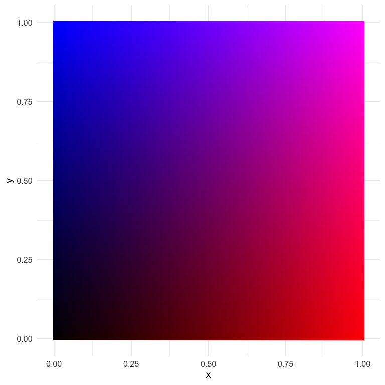
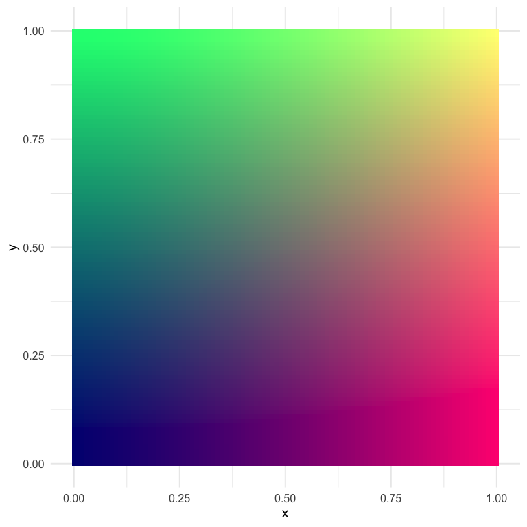

I'm taking some time off work this week to be with my two girls in their final week of summer. But in that time I started playing around with colors in R a bit and wanted to share some of what I've learned, specifically in relation to bivariate color palettes. There is an existing R package, [{biscale}](https://slu-opengis.github.io/biscale/index.html), which is probably the simplest way to approach this, but I wanted to dig in a bit more and explore on my own. For more background, I suggest [this](https://www.joshuastevens.net/cartography/make-a-bivariate-choropleth-map/) blog post by Joseph Stevens, and for a beautiful example and a nice walk-through, see [this](https://timogrossenbacher.ch/2019/04/bivariate-maps-with-ggplot2-and-sf/) post by Timo Grossenbacher.

# Bivariate palettes
Basically everything I came across when exploring how to create bivariate palettes were just a series of color codes. For example, in Timo's example he uses the following code to create a bivariate color palette.


```r
library(tidyverse)
 bivariate_color_scale <- tibble(
  "3 - 3" = "#3F2949", 
  "2 - 3" = "#435786",
  "1 - 3" = "#4885C1", 
  "3 - 2" = "#77324C",
  "2 - 2" = "#806A8A", 
  "1 - 2" = "#89A1C8",
  "3 - 1" = "#AE3A4E", 
  "2 - 1" = "#BC7C8F",
  "1 - 1" = "#CABED0" 
)
```

which then ends up looking like this


```r
bivariate_color_scale %>%
  gather("group", "fill") %>%
  separate(group, into = c("x", "y"), sep = " - ") %>%
  mutate(x = as.integer(x),
         y = as.integer(y)) %>%
ggplot(aes(x, y)) +
	geom_tile(aes(fill = fill)) +
	scale_fill_identity()
```

<!-- -->

Joshua Stevens also provides similar 3 x 3 bivariate scales, and specifically cautions that it's dangerous to go alone (exactly what I wanted to do!).

<iframe src="https://www.joshuastevens.net/images/js_bivariatePalettes.png" width="100%" height="175px"></iframe>

But what if I wanted 4 or 5 categories? Or what if I even wanted to map continuous scales?

## Creating a custom palette
While looking around for different bivariate scales, I came across a [blog post by Len Kiefer](http://lenkiefer.com/2017/04/24/bivariate-map/) where he shows how to transform the viridis palette into a bivariate scale as follows (note: I've slightly modified his code to match my coding style)


```r
d <- expand.grid(x = seq(0, 1, 0.01), y = seq(0, 1, 0.01)) %>%
  mutate(fill_val = atan(y/x),
         transparency = x + y)

ggplot(d, aes(x, y, fill = fill_val, alpha = transparency)) +
  geom_tile() +
  scale_fill_viridis_c() +
  theme_void() +
  theme(legend.position = "none")
```

<!-- -->

Why do we divide `y` by `x` and take the arc tangent?... 🤷 

I really have no idea, but it works! Part of what is interesting about this approach is that we change the *color* by (in part) changing the *transparency* of the fill. This is pretty clever, I think.

I also like this approach because it seems to work pretty well for just about any sequential palette. Here's a few more examples


```r
# install.packages("paletteer")
library(paletteer)

ggplot(d, aes(x, y, fill = fill_val, alpha = transparency)) +
  geom_tile() +
  scale_fill_paletteer_c(harrypotter, HermioneGranger) +
  theme_void() +
  theme(legend.position = "none")
```

<!-- -->

And it even works fairly well for (some) diverging palettes.


```r
ggplot(d, aes(x, y, fill = fill_val, alpha = transparency)) +
  geom_tile() +
  scale_fill_paletteer_c(scico, berlin) +
  theme_void() +
  theme(legend.position = "none")
```

<!-- -->


```r
ggplot(d, aes(x, y, fill = fill_val, alpha = transparency)) +
  geom_tile() +
  scale_fill_paletteer_c(harrypotter, HarryPotter) +
  theme_void() +
  theme(legend.position = "none")
```

<!-- -->

### Using rgb
Another alternative I came across from [this stackoverflow question/answer](https://stackoverflow.com/questions/11773295/how-can-one-mix-2-or-more-color-palettes-to-show-a-combined-color-value), is to just use the rgb values directly, varying one of the colors over many combinations of the other two. Here's an example with (basically) the code from the accepted answer.


```r
d <- d %>%
  mutate(mix1 = rgb(red = x, green = 0, blue = y))

ggplot(d, aes(x, y)) + 
  geom_tile(aes(fill = mix1)) + 
  scale_fill_identity()
```

<!-- -->

I think this one is actually quite nice, and it gives us almost infinite flexibility (which may not be a good thing). Let's try again with slightly different values.


```r
d <- d %>%
  mutate(mix2 = rgb(red = x, green = y, blue = 0.5))

ggplot(d, aes(x, y)) + 
  geom_tile(aes(fill = mix2)) + 
  scale_fill_identity()
```

<!-- -->

This one has some pretty distinct quadrants, which could be helpful if we're thinking about having color represent two things.

# How do we actually use these scales?
So in the above, we've created and viewed a couple of different scales, but how do we go about using them with our data? There's plenty of different ways, but I'm going to talk about the first way I thought of, which is a bit hacky but kind of neat.

## A ggplot hack
For this example, let's play with the last palette we created. The data used to create any plot created from `ggplot2` can be returned using the `ggplot_build` function. Below, I first save the plot, then pull the data I want out using this function (and then limit the data to only the things I really want).


```r
p <- ggplot(d, aes(x, y)) + 
  geom_tile(aes(fill = mix2)) + 
  scale_fill_identity()

pal_d <- ggplot_build(p)$data[[1]] %>%
  select(x, y, fill) %>%
  mutate(x = as.character(x),
         y = as.character(y))
head(pal_d)  
```

```
##      x y    fill
## 1    0 0 #000080
## 2 0.01 0 #030080
## 3 0.02 0 #050080
## 4 0.03 0 #080080
## 5 0.04 0 #0A0080
## 6 0.05 0 #0D0080
```
Now we have a palette that we can use by just rescaling our observed data to the $[0, 1]$ range! Notice also that I made the x and y values characters rather than doubles to help with the joining that will come (i.e., only two decimals of precision).

Let's try with the `ggplot2::mpg` data set, coloring the points according to their values on each axis. We'll show the correlation between engine displacement (`displ`) and highway miles per gallon (`hwy`).


```r
hwy_mpg <- mpg %>%
  mutate(x = as.character(round(scales::rescale(displ), 2)),
         y = as.character(round(scales::rescale(hwy), 2))) %>%
  left_join(pal_d) 
hwy_mpg
```

```
## # A tibble: 234 x 14
##    manufacturer model displ  year   cyl trans drv     cty   hwy fl    class
##    <chr>        <chr> <dbl> <int> <int> <chr> <chr> <int> <int> <chr> <chr>
##  1 audi         a4      1.8  1999     4 auto… f        18    29 p     comp…
##  2 audi         a4      1.8  1999     4 manu… f        21    29 p     comp…
##  3 audi         a4      2    2008     4 manu… f        20    31 p     comp…
##  4 audi         a4      2    2008     4 auto… f        21    30 p     comp…
##  5 audi         a4      2.8  1999     6 auto… f        16    26 p     comp…
##  6 audi         a4      2.8  1999     6 manu… f        18    26 p     comp…
##  7 audi         a4      3.1  2008     6 auto… f        18    27 p     comp…
##  8 audi         a4 q…   1.8  1999     4 manu… 4        18    26 p     comp…
##  9 audi         a4 q…   1.8  1999     4 auto… 4        16    25 p     comp…
## 10 audi         a4 q…   2    2008     4 manu… 4        20    28 p     comp…
## # … with 224 more rows, and 3 more variables: x <chr>, y <chr>, fill <chr>
```

```r
ggplot(hwy_mpg, aes(displ, hwy)) +
  geom_point(aes(color = fill)) +
  scale_color_identity() +
  guides(color = "none")
```

<!-- -->

And there we have it!

## A more realistic example
Generally we don't want bivariate scales for a scatter plot. Instead, we want them for geographical maps, specifically bivariate choropleths. Below is a quick example with the same palette we used above. We'll use the scale to show county-level values for percentage of people reporting Hispanic backgrounds, according the US Census, and the median earnings of the county for people over 16 years old.


```r
library(tidycensus)
race_table <- get_acs(geography = "county",
                      geometry = TRUE,
                      output="wide", 
                      table = "B03002",
                      state = "CA")

race_table <- race_table %>%
  select(county = NAME, 
         hisp = B03002_012E,
         total = B03002_001E) %>%
  mutate(p_hisp = hisp/total)

earnings_table <- get_acs(geography = "county",
                          geometry = FALSE,
                          output="wide", 
                          table = "B20018",
                          state = "CA") %>%
  select(county = NAME,
         earnings = B20018_001E)

geo <- left_join(race_table, earnings_table)
geo

geo <- geo %>%
  mutate(x = as.character(round(scales::rescale(p_hisp), 2)),
         y = as.character(round(scales::rescale(earnings), 2))) %>%
  left_join(pal_d)
geo

ggplot(geo) +
  geom_sf(aes(fill = fill)) +
  guides(fill = "none")
```

<!-- -->

This is pretty close! But we need a legend on there. We'll do this by creating separate plots and putting them together with {cowplot}


```r
library(cowplot)
map <- ggplot(geo) +
  geom_sf(aes(fill = fill)) +
  guides(fill = "none")

legend <- ggplot(pal_d, aes(x, y)) +
  geom_tile(aes(fill = fill)) +
  scale_fill_identity() +
  labs(x = "Higher Percent Hispanic -->",
       y = "Higher Earnings -->") +
  theme_void() +
  theme(axis.title = element_text(size = 8),
  	    axis.title.y = element_text(angle = 90)) +
  coord_fixed()

ggdraw() +
  draw_plot(map, 0, 0, 1, 1) +
  draw_plot(legend, 0.02, 0.05, 0.3, 0.3)
```

<!-- -->

Better! And it is rather revealing. There's lots of areas of pink (high percentage Hispanic, low relative earnings) and quite a bit of green (low percent Hispanic, high relative earnings). The tan and brown colors indicate areas where the percentage of people with Hispanic origin is moderately high, as are their earnings.

Importantly, I'm not sure this particular color scale is working as well as it could. In fact, I'm essentially positive we could get more interpretable results with another color scheme (perhaps a different one we used above). But it's still sort of fun to play around with fully custom palettes. Finally, we might also benefit by collapsing the color scale into categories, as is more typical, because it would limit the number of colors and therefore limit the amount of information our brains are trying to process. Of course, that would also mean the colors would be slightly less representative of the actual bivariate value. Which *really* works best for lay or even moderately informed audiences is (at least for me) an open question.

# Wrapping up
That's probably good for now. I know the actual producing of the choropleth was super fast, but I'll try to follow up with a second blog post on tweaks there, and we'll try different things like I mention above to try to make it better. But at least we've been able to go through the process and see a real-world example of where it may make sense to use a bivariate color scale. 
